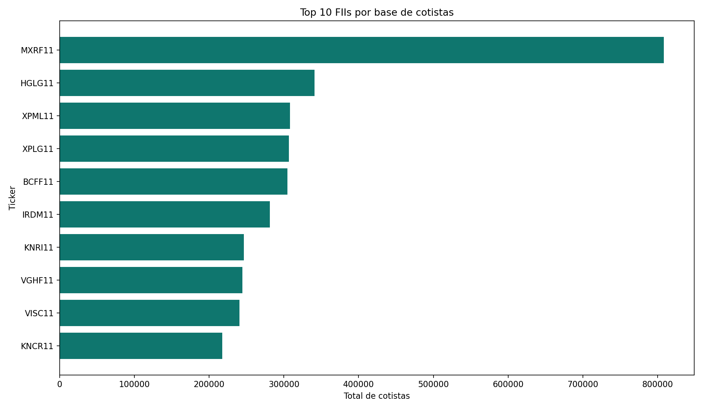
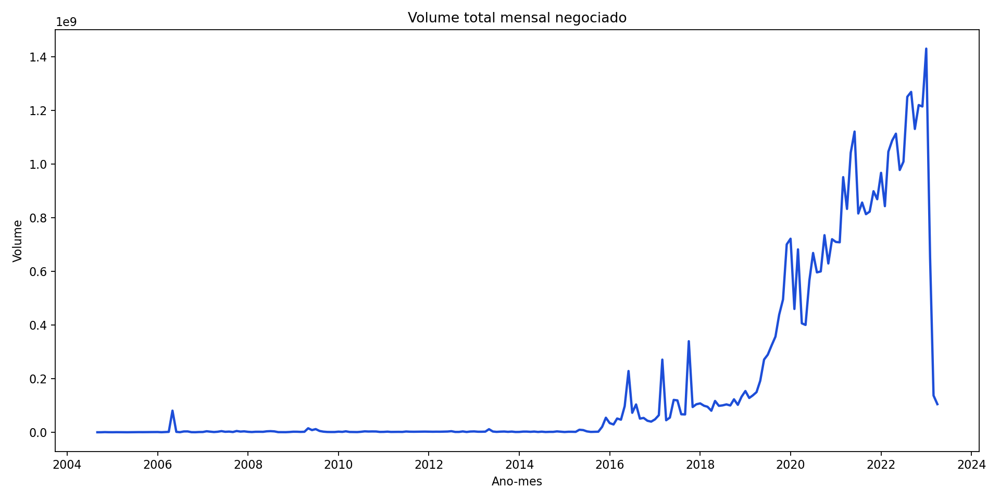
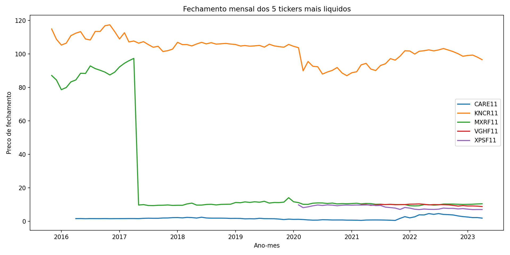

# Insights do Case

Este projeto foi desenhado para apresentar um fluxo simples e convincente de engenharia de dados aplicado ao mercado de FIIs.

## Recorte escolhido

Em vez de usar todas as tabelas do dataset, o case prioriza 4 fontes com melhor potencial analitico:

- cadastro dos fundos
- relacao fundo x ticker
- informes mensais
- cotacoes historicas

Esse recorte permite responder perguntas de negocio e, ao mesmo tempo, manter o repositorio leve e facil de explicar em entrevistas.

## O que analisar nos outputs

- `fii_snapshot_latest.csv`: ultimo retrato disponivel de cada fundo
- `top_fundos_por_cotistas.csv`: ranking dos fundos com maior base de investidores
- `mercado_mensal.csv`: evolucao do volume negociado e da quantidade de tickers ativos por mes
- `historico_top5_tickers.csv`: serie mensal dos tickers mais liquidos

## Graficos gerados

## Narrativa para apresentacao

1. O dataset bruto foi reduzido para um escopo analitico claro.
2. Os dados foram padronizados e limpos para evitar outliers absurdos em metricas mensais.
3. A camada gold consolida informacoes suficientes para ranking, acompanhamento de mercado e comparacao entre tickers.
4. O projeto foi estruturado para ser reproduzivel, facil de versionar e pronto para evoluir para ferramentas maiores.
